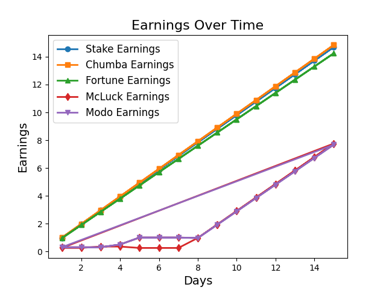

# Bonus Harvest

Generate income from legal loopholes in the terms of service of online social casinos.

## TL;DR

BonusHarvest is a app that helps its users leverage _[social casinos](https://finance.yahoo.com/news/social-casinos-really-free-050000980.html?guccounter=1)_ and their Terms of Service to generate passive income using 'Daily Bonus' offers used by these casinos to legally be considered sweepstakes and avoid regulatory compliance and looser licensing and permit requirements.

This app allows its users to set-up accounts in these _social casinos_ and give away their ability to log back in (as prevention to avoid users from participating in gambling) while 'Daily Login Bonuses' are redeemed every 24h across all desired sites. Additionally, all winnings are played through the games with the highest Return to Player (RTP) and minimum amount in order to generate the highest payout^†^. Lastly, BonusHarvest automates the withdrawal process by sending an email to the user notifying them they have hit the minimal withdrawal amount in their accounts.

The team at BonusHarvest has calculated that with our app, each individual user is able to conservatively generate $1,500 of passive income a year with less than an hour of initial set-up time using all 5 compatible sites and current Average Payout Rates (Last Updated January 2024).

^†^ All funds obtained in social casinos, including deposits and 'Daily Login Bonuses' are required to be played through in order to be eligible for withdrawal

## What are social casinos?

Social casinos are online platforms that offer casino-style games for enterntainment purposes. In these websites, users can 'simulate' online. These casinos use their own currencies as to avoid being regulated as 'real' casinos. Another practice they use to avoid regulation and demark diferentiation from 'real' online casinos is that they allow users the ability to earn casino currency through _[mail-ins]()_, daily sign-in bonuses, promotional giveaways and other practices.

These social casinos are legally considered 'sweepstakes'

## How does the app work?

### 1. Fencing in the Garden (Password Generation) 🔐

This step allows for the generation of a secure passwords of the user's desired length. This secure and hard to remember password is used to then overwrite the password generated by the user during the manual initial set-up.

This steps aims to create a barrier between BonusHarvest and the 'social casinos' being 'farmed' as to increase the difficulty of accessing these sites and decreasing the likelihood of users playing games or buying in-game currency. The goal of BonusHarvest is to generate passive income through the exploitation terms and conditions of these sites, not to promote or serve as a gate-way to online gambling.

The passwords are hexadecimal based and are generated using a simple program that generates the number of bytes for the passoword using the desired length of the password. Then the cryptography python package 'secrets' is used to randomly generate values for the bytes calculated in the last step. Finally, the values are converted into hexadecimal form and the password is printed in the console.

### 2. Arrival to the Fields (Account Login) 🧑‍🌾

This step allows for the access of different 'social casino' websites using usernames and hidden, secure passwords generated in step 1. This allows BonusHarvest to start the 'farming' process in the following steps.

### 3. Daily Farming (Daily Bonus Acquisition) 🌾

During this step, BonusHarvest completes each of site-specific necessary steps for obtaiing the daily harvest (Daily Bonuses).

### 4. Gleaning the Cash-Crops (Enabling Funds for Withdrawal) 🚜

During this step, BonusHarvest plays through credits, maximizing for the highest winning rate and cashout balance for every _social casino_.

The website [BestOdds.com](https://www.bestodds.com/) was used to determine the best gleaning strategy for maximizing

### 5. Harvest Time (Cash-out) 🌽

This step is set up so that funds in these 'social casinos' are automatically withdrawn as soon as a monetary threshold is achieved. Cashout method is determined by user preference (direct deposit, cryptocurrency or giftcard). Email is sent to user letting them know that funds will be sent to preferred payment method. Option is given to change preference in the cashout amount (Normally $50+ per site)

## How much money can be made?

### Weekly earnings|

| Social Casino |                 Average Weekly Earnings                  | Return to Player (RTP)^\*^ |                 Average Payout Rate (Weekly)                 |
| :-----------: | :------------------------------------------------------: | :------------------------: | :----------------------------------------------------------: |
|   Stake.us    |                            $7                            |            98%             |                            $6.86                             |
| Chumba Casino |                            $7                            |           96.78%           |                            $6.77                             |
| Fortune Coins |                            $7                            |           95.33%           |                            $6.67                             |
|    McLuck     | <u>First Week:</u> $2.8   <u>Weeks thereafter:</u> $7 |           96.57%           | <u>First Week:</u> $2.70   <u>Weeks thereafter:</u> $6.76 |
|    Modu.us    |   <u>First Week:</u>   <u>Weeks thereafter:</u> $7    |           95.93%           | <u>First Week:</u> $4.22   <u>Weeks thereafter:</u> $6.72 |

^\*^ RTP is a proportion of average earnings in a game over time. This is calculated based on most profitable gleaning strategies (this project specifically used [BestOdds.com](Bestodds.com), [Covers.com](covers.com) and [UScasinos.com](uscasinos.com))\_

## List of compatible social casinos

- [Stake.us](stake.us)
- [Chumba Casino](https://lobby.chumbacasino.com/)
- [Fortune Coins](https://www.fortunecoins.com/)
- [McLuck](https://www.mcluck.com/)
- [Modo.us](https://modo.us/)

## How To Use

## Gleaning Strategy (Last Updated January 2024)

| Social Casino |                          Target Game                           |    Return to Player (RTP)\*     | Volatility | Average Payout Rate\* |
| :-----------: | :------------------------------------------------------------: | :-----------------------------: | :--------: | :-------------------: |
|   Stake.us    |                              Dice                              |               98%               |   Low 🟢   |         0.98          |
| Chumba Casino |   Halloween Fortune   Butterfly Staxx   Anaconda Wild    | 97.07%   96.80%   96.47%  |  High 🔴   |        0.9678         |
| Fortune Coins |       Pyramids of Giza   Fairy Tail   Lucky Panda        |      96%   96%   94%      |  Unknown   |        0.9533         |
|    McLuck     | Big Bass Bonanza   Buffalo King Megaways   Joker's Jewel |  96.71%   96.52   96.50%  |  Unknown   |        0.9657         |
|    Modo.us    |  Money Train 2   Buffalo Hold and Win   Mighty Gorilla   | 96.4%   95.91   95.49  |  Unknown   |        0.9593         |

## Deployment

Decided against using Gmail API for in-wesbite verification as it increased project complexity significantly just for one mail application. Selenium was used to scrape for data from Gmail, Outlook Mail and \_\_\_.

## Extras

### Sign-Up Bonus Links

The following links are sign-up links with bonuses. Using these links support the development of this project.

- [Stake.us](stake.us/?c=jiO2uEBV)
- Chumba Casino (No Referral Link)
- [Fortune Coins](https://www.fortunecoins.com/register/e3dc78b0-ef38-400c-914b-a4fa7fdb3e2b)
- [McLuck](https://www.mcluck.com/?r=879233479)
- [Modo.us](https://modo.us?referralCode=FGr7QdBZVre2)

### VIP Status

Over time, as in-game currency is played through the social casinos

### Earnings Projection

RTP database for all online slot games + cross reference with compatible social casinos and shared slots
https://www.letsplayslots.com/slots-rtp
